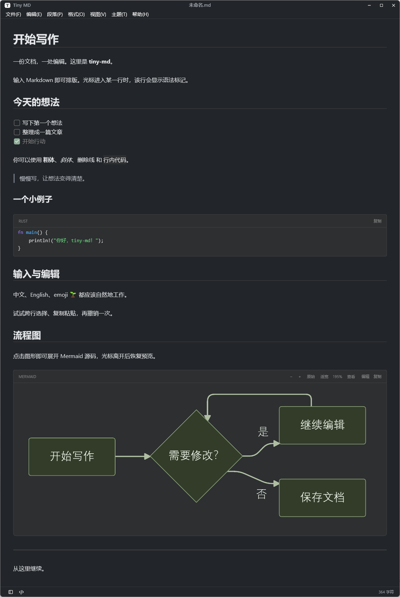

# Tiny MD

### 在同一份文档中写作、排版与编辑源码。

[](https://github.com/ynx-official/tiny-md/releases/latest)


[](LICENSE)

[下载](https://github.com/ynx-official/tiny-md/releases/latest) · [文档](docs/README.md) · [更新日志](CHANGELOG.md)

## Features

✍️ **即时排版**，边写边预览，源码模式共享编辑内容与撤销历史。

🧩 **代码、表格与流程图**，支持代码高亮、表格网格编辑和 Mermaid 独立查看。

🧭 **文档导航**，文档列表、目录树、大纲与查找替换。

🌗 **专注写作**，浅色 / 深色主题、专注模式与打字机模式。

🛡️ **文件修改保护**，同步外部修改，合并不重叠编辑，冲突时保留本地内容。

🔄 **应用内更新**，查看版本日志、下载校验，安装前检查未保存文档。

## 🌻 为什么做 Tiny MD

Tiny MD 面向本机 Markdown 笔记和技术文档写作。
写作、即时排版和源码编辑围绕同一份文档展开，文件可以继续交给其他编辑器处理。

## 📦 安装

从 [GitHub Releases](https://github.com/ynx-official/tiny-md/releases/latest) 下载对应平台的发行包。

| 平台 | 安装方式 |
|---|---|
| Windows x64 | 使用 EXE 安装包，或解压便携 ZIP 后运行 `tiny-md.exe` |
| macOS Apple Silicon（arm64） | 打开 DMG，将 `Tiny MD.app` 拖入 Applications；也提供便携 ZIP |

启动后通过“文件”菜单打开或新建文档。Windows 使用 Ctrl+S 保存，macOS 使用 ⌘S 保存。

## ✨ 软件预览

> Windows 界面截图，点击图片可查看原图。

### 🌗 写作与排版

| 浅色主题 | 深色主题 |
|:---:|:---:|
| [](assets/img/writing-light.png) | [](assets/img/writing-dark.png) |

### 🔄 在线更新

检查版本、阅读 Markdown 更新日志；主题与自动更新选项在“文件 → 偏好设置”中管理。

[](assets/img/online-updates.png)

## 🛠️ 技术栈

| 用途 | 技术 |
|---|---|
| 语言与构建 | Rust（Edition 2024）/ Cargo workspace |
| 原生界面 | GPUI 0.2.2 |
| 界面组件 | GPUI Component 0.5.0 |
| Markdown 编辑核心 | Guise（guise-ui）1.9.1 |
| 代码高亮 | Syntect 5.3.0 |
| 流程图渲染 | mermaid-rs-renderer 0.3.1 |

## 🚀 从源码运行

在项目根目录执行，需要 Rust stable。Windows 使用 MSVC x64 工具链。

### Windows

安装 Visual Studio C++ 构建工具与 Windows SDK，脚本会自动加载编译环境。

```powershell
./scripts/run-windows.ps1
```

### macOS

安装 Command Line Tools。GPUI 在运行时编译 Metal 着色器，无需完整 Xcode。

```sh
cargo run --locked -p tiny-md
```

打开示例文档：

```sh
cargo run --locked -p tiny-md -- fixtures/welcome.md
```

Windows 的示例启动使用 `./scripts/run-windows.ps1 -Document './fixtures/welcome.md'`。
检查命令为 Windows 的 `./scripts/check.ps1` 或 macOS 的 `sh scripts/check.sh`，需要 Python 3.11+。
打包说明见 [构建发布](docs/releases.md)。

## ❓ 常见问题

**笔记保存在哪里？**

保存在你选择的本机 Markdown 文件中。

**打开笔记会替换当前文档吗？**

侧栏文档列表 / 文档树在当前窗口切换，未保存内容需要先处理。
文件菜单、最近文件和拖放只复用空白未命名窗口，已有笔记继续保留。
完整规则见 [文档窗口](docs/02-design/document-windows.md)。

**目前有哪些限制？**

尚未支持图片内嵌预览、导出 / 打印、自动保存与崩溃恢复。
功能说明与实际验收范围见 [文档索引](docs/README.md) 和 [验证记录](docs/verification.md)。

## 💙 参与贡献

欢迎通过 [Issues](https://github.com/ynx-official/tiny-md/issues) 反馈问题，或通过
[Pull Requests](https://github.com/ynx-official/tiny-md/pulls) 参与改进。
问题反馈请附操作系统、应用版本和复现步骤。

如果 Tiny MD 对你有帮助，欢迎给项目一个 ⭐。

## 🍁 开源协议

**MIT License**，完整条款见 [LICENSE](LICENSE)。

第三方依赖与改编代码保留各自的许可证和版权声明。
Guise 编辑器适配的来源见 [第三方代码说明](crates/editor-adapter/THIRD_PARTY.md)，
原始许可见 [LICENSE.guise](crates/editor-adapter/LICENSE.guise)。
