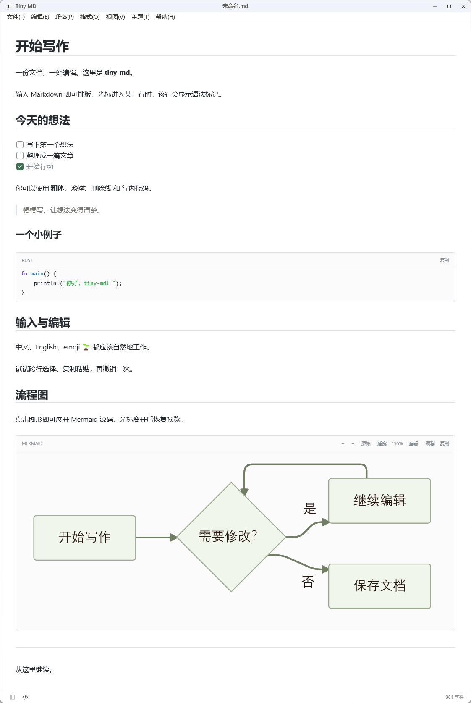
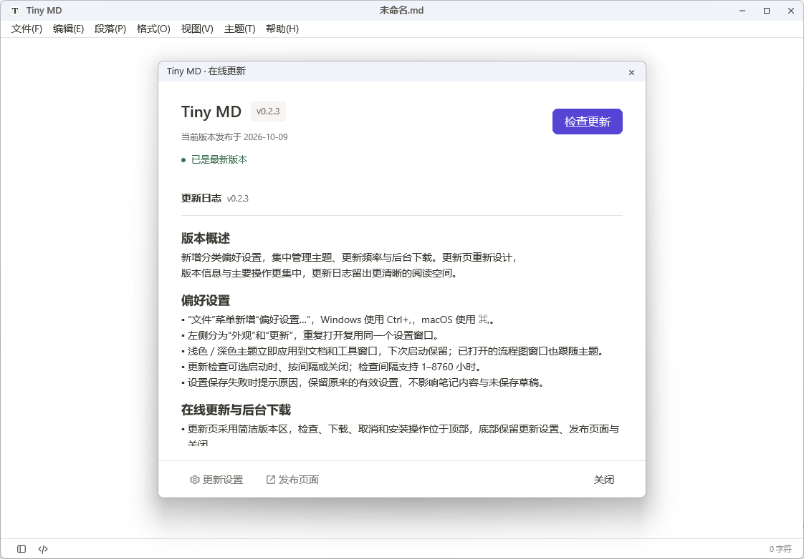

# Tiny MD

简洁的原生 Markdown 编辑器，使用 Rust 构建，支持 Windows x64 与 macOS Apple Silicon。
即时排版与源码编辑共用一个文档，内容保存为本机 Markdown 文件。

[下载](https://github.com/ynx-official/tiny-md/releases/latest) · [更新日志](CHANGELOG.md) · [文档](docs/README.md) · [MIT 协议](LICENSE)

- **写作**：即时排版、源码模式、查找替换，保留撤销历史。
- **内容**：代码高亮、可编辑表格、Mermaid 流程图与独立查看。
- **导航**：文档列表、目录树、大纲与多窗口。
- **体验**：深浅主题、专注模式、外部文件同步与应用内更新。

## 软件预览

Windows 界面截图，点击图片可查看原图。

| 浅色主题 | 深色主题 |
|:---:|:---:|
| [](assert/img/writing-light.png) | [](assert/img/writing-dark.png) |

**在线更新**

[](assert/img/online-updates.png)

## 下载使用

从 [GitHub Releases](https://github.com/ynx-official/tiny-md/releases/latest) 获取发行包。

| 平台 | 安装方式 |
|---|---|
| Windows x64 | 使用 EXE 安装包，或解压便携 ZIP 后运行 `tiny-md.exe` |
| macOS Apple Silicon（arm64） | 打开 DMG，将 `Tiny MD.app` 拖入 Applications；也提供便携 ZIP |

启动后通过“文件”菜单打开或新建文档。Windows 使用 Ctrl+S 保存，macOS 使用 ⌘S 保存；
主题与更新选项在“文件 → 偏好设置”中管理。

图片内嵌预览、导出 / 打印、自动保存与崩溃恢复尚未实现。
功能说明和验收范围见 [文档索引](docs/README.md)，版本变化见 [更新日志](CHANGELOG.md)。

## 技术栈

| 用途 | 技术 |
|---|---|
| 语言与构建 | Rust（Edition 2024）/ Cargo workspace |
| 原生界面 | GPUI 0.2.2 |
| 界面组件 | GPUI Component 0.5.0 |
| Markdown 编辑核心 | Guise（guise-ui）1.9.1 |
| 代码高亮 | Syntect 5.3.0 |
| 流程图渲染 | mermaid-rs-renderer 0.3.1 |

代码按职责划分为四个模块：

| 目录 | 职责 |
|---|---|
| `crates/app` | 窗口、菜单与文件交互 |
| `crates/editor-adapter` | Markdown 编辑与平台输入 |
| `crates/document` | 磁盘状态、文件保存与外部同步 |
| `crates/updater` | 更新检查、下载校验与安装助手 |

## 源码运行

在项目根目录执行。需要 Rust stable；运行检查脚本还需 Python 3.11+。

**Windows**

使用 MSVC x64 工具链，需要 Visual Studio C++ 构建工具与 Windows SDK。脚本会自动加载编译环境。

```powershell
./scripts/run-windows.ps1
```

**macOS**

需要 Command Line Tools。GPUI 在运行时编译 Metal 着色器，无需完整 Xcode。

```sh
cargo run --locked -p tiny-md
```

打开示例文档：

```sh
cargo run --locked -p tiny-md -- fixtures/welcome.md
```

Windows 的示例启动请使用 `./scripts/run-windows.ps1 -Document './fixtures/welcome.md'`。
代码检查使用 Windows 的 `./scripts/check.ps1` 或 macOS 的 `sh scripts/check.sh`。
打包与平台说明见 [构建发布](docs/releases.md) 和 [Windows 开发](docs/05-operations/windows.md)。

## 开源协议

Tiny MD 采用 **MIT License** 开源，完整条款见 [LICENSE](LICENSE)。

第三方依赖与改编代码保留各自的许可证和版权声明。
Guise 编辑器适配的来源见 [第三方代码说明](crates/editor-adapter/THIRD_PARTY.md)，
原始许可见 [LICENSE.guise](crates/editor-adapter/LICENSE.guise)。
