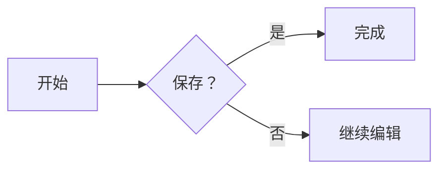

# 代码与流程图

## 代码块

```rust
fn main() {
    let message = "你好，tiny-md！";
    println!("{message}");
}
```

## 流程图



点击流程图编辑，再点击这里恢复预览。

## 纵向流程图

~~~mermaid
graph TD
    A[打开文档] --> B[编辑内容]
    B --> C{内容有效？}
    C -->|是| D[保存]
    C -->|否| B
~~~

## 语法错误

```mermaid
flowchart LR
    A[未闭合 --> B
```

错误的源码仍然可以编辑、复制和保存。
