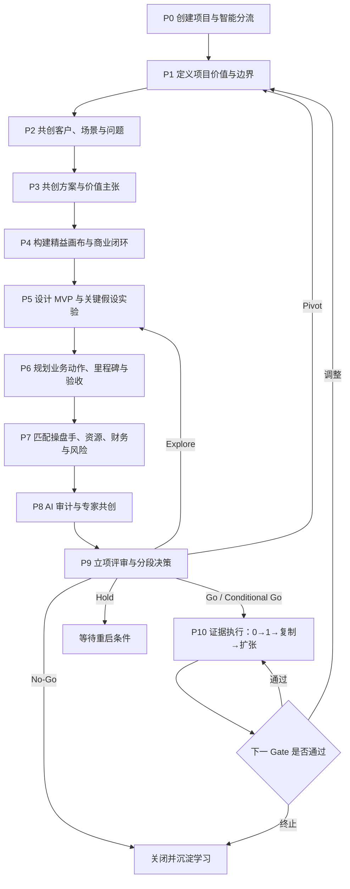

# 0-1 立项工具：产品定义与共创工作流（V2.0）

> 本文将 V1.0 的立项方法论转化为产品定义、用户工作流、提问框架和完整度标准，可直接作为产品原型、功能设计及后续 PRD 的上位依据。

## 一、产品定义

### 1. 一句话定义

一款面向企业内部新业务孵化与项目投资决策的 AI 共创式立项工具，通过结构化追问、证据管理、逻辑审计、专家共创和阶段 Gate，把一个模糊想法转化为“可决策、可执行、可验收、可止损”的阶段性投资方案。

### 2. 核心产品命题

用户真正要完成的任务不是“写一份立项报告”，而是：

> 在正式投入资金和抽调核心人员之前，把一件事是否值得做、准备怎么做、由谁来做、需要什么资源、最坏会怎样看清楚，并决定下一阶段是否值得投入。

因此，产品交付的不是一份漂亮文档，而是一个可信的项目决策包：

1. 事情逻辑：客户、问题、方案、价值、市场和商业逻辑是否自洽。
2. 动作逻辑：MVP 客户从哪里来、怎么触达、怎么转化、怎么交付。
3. 执行条件：操盘手、团队、资源、预算和组织授权是否匹配。
4. 决策条件：证据强度、风险、收益、止损和下一 Gate 是否明确。

### 3. 目标用户与核心任务

| 用户角色 | 核心任务（JTBD） | 当前痛点 | 产品价值 |
|---|---|---|---|
| 立项发起人 | 把想法讲清楚并推动立项 | 思考偏科、表达散、缺少方法、反复返工 | AI 引导补齐盲区，形成结构化项目命题 |
| 未来操盘手 | 确认项目究竟怎么跑、自己能否完成 | 接到项目后才发现路径、资源和授权不清 | 在拨款前共同确认路径、能力与资源 |
| 决策人/出资人 | 判断值不值得投入、投多少、何时停 | 报告只有概念，没有动作、证据和最坏情况 | 获得按维度呈现的决策看板和分段投资方案 |
| 领域专家 | 对关键模块提供深度判断 | 介入太晚、意见散落、无法追踪是否被采纳 | 在指定维度定向共创，形成结论与证据记录 |
| 资源负责人 | 判断人、渠道、技术、数据等能否支持 | “公司支持”没有落到数量、时间和责任人 | 把资源需求转成可确认的承诺 |
| PMO/项目管理者 | 追踪项目是否按 Gate 获取证据 | 立项报告与执行脱节，项目长期空转 | 以 Gate、实验和证据持续跟踪项目 |

### 4. 核心使用场景

1. 内部提出一项新业务、新产品或新服务，决定是否立项。
2. 对现有点子进行二次论证，决定继续、转向还是终止。
3. 内部提效、数字化、AI 或组织能力项目，判断价值和投入是否成立。
4. 对外合作、联合孵化或项目投资，判断业务、人和资源是否匹配。
5. 项目立项后，用同一套假设和 Gate 追踪 0→1、1→复制和扩张。

### 5. 产品边界

#### 产品负责

- 帮用户全面、深入地想清楚项目。
- 将主观想法转成可验证假设。
- 发现客户、价值、渠道、价格、动作、资源之间的矛盾。
- 生成第一套可执行的 MVP 与业务路径。
- 管理证据、评审意见、决策和分段拨款条件。
- 立项后持续记录实验结果并触发下一 Gate。

#### 产品不负责

- 不承诺项目一定成功。
- 不替代决策人作最终投资决定。
- 不用一个综合总分掩盖项目致命短板。
- 不把 AI 推测包装成事实或市场证据。
- 不在立项阶段提前生成完整 PRD、完整 SOP 或扩张期全部细节。
- 首版不替代 CRM、项目管理、财务、ERP 和数据分析系统。

### 6. 产品北极星与效果指标

**北极星指标：** 在规定周期内形成“评审就绪项目决策包”的项目比例。

“评审就绪”必须同时满足：必填维度完整、核心逻辑无致命冲突、关键假设有验证计划、MVP 可执行、人和资源可确认、下一 Gate 可验收。

| 指标层 | 指标建议 | 说明 |
|---|---|---|
| 用户价值 | 从建项到评审就绪的周期 | 是否真正缩短了立项时间 |
| 用户价值 | 首次评审需要补充的核心问题数 | 是否减少反复返工 |
| 决策质量 | 决策人认为“可以明确决策”的项目比例 | 不是看报告是否写完 |
| 执行质量 | 立项后能在约定时间启动首个实验的比例 | 验证方案是否可执行 |
| 风险控制 | 在止损线前被及时转向/终止的项目比例 | 是否减少无效投入和长期空转 |
| 学习效率 | 单位时间/预算关闭的关键假设数 | 项目是否在快速降低不确定性 |
| 业务效果 | 通过 G4、G5 的项目比例及投入产出 | 作为滞后指标，不用于美化早期报告 |

## 二、核心产品对象

### 1. 项目论证图谱

产品的核心数据对象不是“报告段落”，而是以下六类对象之间的关系：

```text
项目结论 Claim
  ├─ 由什么证据 Evidence 支持
  ├─ 还包含什么假设 Assumption
  ├─ 用什么实验 Experiment 验证
  ├─ 转成什么行动 Action
  ├─ 由谁 Owner 负责
  └─ 影响哪个决策 Gate / Decision
```

任何报告、画布、看板和评审材料，都由这张图谱自动生成。用户修改客户、产品、渠道、价格或资源后，系统应提示所有受影响的下游结论重新确认。

### 2. 维度卡片

每个共创维度都是一张结构化卡片，至少包含：

| 字段 | 含义 |
|---|---|
| 当前结论 | 当前团队相信什么 |
| 事实与证据 | 数据、原始记录、文件、链接、访谈原话 |
| 证据等级 | E0 主观判断到 E4 交易/重复证据 |
| 未决假设 | 尚未证明且可能改变决策的内容 |
| 反例/冲突 | 与当前结论不一致的事实和内部矛盾 |
| 下一动作 | 补证、共创、实验或资源确认 |
| 通过标准 | 继续、转向和停止的阈值 |
| 责任与期限 | 负责人、协作者、时间、预算 |
| 状态 | 缺失、假设、待补证、已验证、不适用、失效 |

### 3. 完整度标准

一个维度只有同时满足以下条件才算“完整”，而不是文字写得很多就算完成：

1. 对象明确：谈的是哪类客户、哪个场景、哪个版本和哪个时间范围。
2. 结论明确：能用一句话说清当前判断。
3. 依据明确：事实与观点分开，证据可追溯。
4. 因果明确：能解释为什么会产生目标结果。
5. 假设明确：不知道的部分不伪装成确定事实。
6. 动作明确：关键假设有验证或落地动作。
7. 标准明确：继续、转向、停止的条件事先写定。
8. 责任明确：有人、有时间、有预算、有依赖。
9. 一致性通过：与其他维度没有未解释的致命冲突。

### 4. 证据等级

| 等级 | 证据形式 | 产品显示 |
|---|---|---|
| E0 | 直觉、个人经验、未经核验的判断 | 假设，不得作为通过依据 |
| E1 | 行业资料、政策、竞品、历史材料 | 案头证据 |
| E2 | 目标客户访谈、观察、内部一手数据 | 定性证据 |
| E3 | 预约、留资、试用、提交资料、投入时间、签意向 | 行为证据 |
| E4 | 付款、合同、复购、留存、连续漏斗数据 | 交易/重复证据 |

## 三、产品工作流总览



### 角色参与规则

| 步骤 | 主责 | 必须参与 | 可邀请 |
|---|---|---|---|
| P0-P1 | 立项发起人 | Sponsor/业务负责人 | 战略、财务 |
| P2-P4 | 立项发起人 | 客户洞察或一线业务 | 产品、市场、专家 |
| P5-P6 | 未来操盘手 | 产品/运营/销售代表 | 数据、交付、技术 |
| P7 | 未来操盘手 | 资源负责人、财务、HR | 法务、品牌、安全 |
| P8 | 立项发起人 | 操盘手、关键专家 | 外部专家 |
| P9 | 决策人 | 发起人、操盘手、财务/资源方 | 专家、PMO |
| P10 | 操盘手 | 实验责任人、PMO | 决策人、专家 |

## 四、逐步工作流、提问维度与完整标准

## P0 创建项目与智能分流

**达成目的：** 识别这是一个什么项目、当前处于什么阶段、谁拥有决策权，从而生成正确的问题路径和必填维度。

**主要输入：** 一句话想法、已有资料、发起背景。

| 提问/共创维度 | 核心提问 | 完整标准 | 产品产出 |
|---|---|---|---|
| 项目类型 | 是对外商业化、内部提效、合规战略、基础能力还是混合项目？ | 主类型明确；混合项目写出主要价值与次要价值，系统据此切换收入/价值标准 | 项目类型标签、专属模板 |
| 当前阶段 | 是点子、调研、方案、MVP、已运营还是转型项目？ | 阶段有事实依据；已有证据和已有投入被记录，不把已有项目重新伪装成零起点 | 起始状态与历史投入 |
| 发起触发 | 为什么现在提出？发生了什么变化？ | 触发事件具体；至少有一个事实或明确的管理决策依据 | Why now 摘要 |
| 角色识别 | 谁提出、谁负责、谁审批、谁出钱、谁使用结果？ | 发起人、Sponsor、审批人和预算权明确；未知角色生成待办 | 初始 RACI |
| 资料盘点 | 已有调研、合同、数据、方案、竞品、财务材料有哪些？ | 已有材料登记来源、日期和适用范围；过期资料被标记 | 证据资料库 |
| 约束条件 | 时间、预算、合规、技术、地域和组织约束是什么？ | 明确不可突破的硬约束与可以协商的软约束 | 约束清单 |

**步骤完成条件：** 项目类型、阶段、Sponsor、决策人和硬约束明确；系统能够生成后续必填维度。

## P1 定义项目价值与边界

**达成目的：** 把模糊想法变成可以讨论和取舍的项目命题，回答“为什么做、做到什么、什么不做”。

| 提问/共创维度 | 核心提问 | 完整标准 | 产品产出 |
|---|---|---|---|
| 项目命题 | 为谁、在什么场景、解决什么、带来什么结果？ | 一句话同时包含对象、场景、变化和结果；不能只写产品名或技术名 | 项目命题 |
| 愿景与终点 | 如果成功，未来出现什么可观察变化？ | 愿景可描述、结果可观察；区分长期愿景与当前阶段目标 | 愿景陈述 |
| 战略关联 | 支撑哪个经营/战略目标？不做会失去什么？ | 关联到具体目标、指标或关键能力；不是泛泛“符合战略” | 战略关联图 |
| Why now | 为什么现在是窗口期？ | 时机由客户、政策、技术、成本、竞争或组织变化支持；至少 E1 | 时机判断 |
| 阶段目标 | 本次立项只要获取什么结果或证据？ | 写业务/学习结果、期限和验收方式；不把“开发上线”当唯一目标 | 本阶段目标 |
| 范围边界 | 本阶段做什么、不做什么？ | 边界能控制投入并覆盖核心风险；明确排除扩张期内容 | In/Out 清单 |
| 成功定义 | 什么算成功、部分成功和失败？ | 至少有结果指标、证据标准和时间范围 | 成败标准 |
| 机会成本 | 投入后会放弃什么或影响什么？ | 关键人员、资金、时间和业务损失被显性记录 | 机会成本清单 |

**AI 共创动作：** 自动把用户描述改写成 2-3 个项目命题版本；指出目标与手段混淆、愿景与一期范围冲突的位置，要求用户确认。

**步骤完成条件：** 项目命题可以被非项目成员准确复述；目标、范围、时机和机会成本无致命矛盾。

## P2 共创客户、场景与问题

**达成目的：** 证明存在值得解决的问题或值得创造的新利益，并找到最可能成为早期采用者的人。

| 提问/共创维度 | 核心提问 | 完整标准 | 产品产出 |
|---|---|---|---|
| 客户角色 | 谁使用、谁受益、谁付款、谁决策、谁影响？ | 多角色分别描述，利益和权力关系清楚；不能笼统写“客户” | 客户角色图 |
| 细分客群 | 哪一类人最可能先需要？如何识别？ | 包含行业/身份、场景、行为、触发、资格和排除条件；可形成名单 | 客群画像 |
| 早期采用者 | 谁最痛、最急、最愿意尝试且最容易接触？ | 有清晰选择逻辑和具体样本来源；不以亲友代替目标客户 | 早期采用者定义 |
| 核心任务/JTBD | 客户在该场景真正想完成什么进步？ | 用客户任务和结果表达，不用产品功能表达 | 客户任务陈述 |
| 用户旅程 | 问题发生前、中、后分别做什么、想什么、接触谁？ | 有触发点、步骤、接触点、心理、成本和关键断点 | 用户旅程图 |
| 核心问题/新利益 | 最值得解决的 1-3 个问题是什么？ | 问题由客户事实支持；区分症状、原因和结果；新需求说明新增利益 | 问题地图 |
| 严重度 | 多痛、多频繁、多紧急、损失多大？ | 至少两个维度可量化或有明确等级依据；说明改变现状的理由 | 问题优先级 |
| 现有替代 | 今天怎么处理？为什么还在用？ | 覆盖“不处理、手工、自建、外购、竞品”；写成本、优点和切换阻力 | 替代方案表 |
| 决策与阻力 | 谁能说“是”，谁能否决，采用阻力是什么？ | 决策链、采购/审批周期、信任和迁移成本明确 | 决策链与阻力 |
| 价值空间 | 有多少对象、单个对象价值多大？ | 口径、计算、来源和假设可复核；内部项目换算为工时、成本、风险或能力价值 | 市场/价值空间 |

**AI 共创动作：** 追问“这是客户原话还是你的解释”“有什么反例”“客户为何不继续用原方案”；自动识别过宽客群和伪需求。

**步骤完成条件：** 能说清一类具体客户在一个具体场景中的核心任务、问题、现有替代和改变理由，并有至少 E2 证据或清晰的一手验证计划。

## P3 共创解决方案与价值主张

**达成目的：** 建立“问题—机制—结果”的因果链，形成客户能理解、能感知、愿意行动的最小解决方案。

| 提问/共创维度 | 核心提问 | 完整标准 | 产品产出 |
|---|---|---|---|
| 问题—方案映射 | 每个核心问题由什么机制解决？ | 核心问题一一对应；无无关功能堆砌；能解释机制为何有效 | 映射图 |
| 价值主张 | 为什么客户应选择我们？ | 一句话包含客群、场景、结果、差异；不是口号或功能列表 | 价值主张 |
| 核心收益 | 客户究竟获得什么可感知变化？ | 收益类型、幅度、出现时间和测量方式明确 | 收益模型 |
| 独特卖点 | 相对现有替代，最值得客户行动的差异是什么？ | 只突出最关键差异；对客户重要、可演示、可验证 | 独特卖点 |
| 解决机制 | 产品/服务的关键作用机制是什么？ | 机制与目标结果存在合理因果链；关键前提和限制明确 | 机制说明 |
| MVP 边界 | 为验证核心价值，最少要提供什么？ | Must/Should/Later 清楚；足以让客户感知卖点，不提前建设完整系统 | MVP 功能/服务清单 |
| 呈现载体 | 客户用什么材料或体验理解方案？ | 与客户和渠道匹配；可为 PPT、DEMO、样机、人工服务、落地页等 | 原型需求 |
| 可行性 | 技术、运营、交付、供应链、合规能否实现？ | 关键难点、验证方式和替代路径明确；致命约束不得隐藏 | 可行性清单 |
| 信任与证明 | 客户凭什么相信效果？ | 案例、数据、认证、试用、担保、专家背书等路径明确 | 信任方案 |
| 门槛/优势 | 什么难以被复制？没有门槛怎么办？ | 现状真实，区分短期卖点与长期壁垒；无门槛则写建立路径 | 优势路线图 |

**AI 共创动作：** 生成多个 MVP 形态并比较验证力、成本和周期；识别“产品很小但卖点也被删掉”或“为了验证而提前造完整产品”的问题。

**步骤完成条件：** 目标客户能通过指定载体理解核心价值；MVP 范围足以验证核心机制；可行性风险有处理方式。

## P4 构建精益画布与商业闭环

**达成目的：** 把分散结论组合为客户、价值、渠道、收入、成本和指标闭环，并发现模块间矛盾。

| 提问/共创维度 | 核心提问 | 完整标准 |
|---|---|---|
| 问题 | 最重要的 1-3 个问题和现有替代是什么？ | 有客户证据，按重要度排序，不混入解决方案 |
| 客户群体 | 谁使用、受益、付费、决策，谁是早期采用者？ | 客群可识别、可触达、可形成样本 |
| 独特价值主张 | 为什么客户应立即关注？ | 清晰、有差异、能复述、能验证 |
| 解决方案 | 用什么最小机制解决核心问题？ | 与问题一一对应，无过度建设 |
| 渠道 | 从哪里找到客户，如何触达、成交、交付、复购？ | 区分各类渠道；首选渠道及理由明确 |
| 收入/价值回报 | 谁为何付钱，或组织获得什么价值？ | 商业项目有价格、频率和付款者；内部项目有可核验价值 |
| 成本结构 | 一次性、持续性、边际和机会成本是什么？ | 人力、获客、交付、服务、技术、管理成本齐全 |
| 关键指标 | 什么指标证明价值和业务成立？ | 有公式、对象、基线、目标、周期和数据源；不用虚荣指标 |
| 不公平优势 | 哪些能力难买、难复制？ | 有事实依据；暂无则标记并制定建立路径 |

### 商业逻辑审计

系统必须自动检查以下关系：

1. 客户是否真的遇到该问题。
2. 方案是否直接改变客户关键任务。
3. 独特卖点是否能在 MVP 中被感知。
4. 渠道中是否存在所定义的客户。
5. 触达工具是否符合客户的决策方式。
6. 收费/价值是否小于客户获得的可感知收益。
7. 成本结构是否支持单位经济或内部价值回报。
8. 指标是否真的能证明项目目标。
9. 门槛是否与扩张目标相匹配。

**步骤完成条件：** 九格必填项全部完整；发现的冲突已解释或转成假设；最危险的 3-5 个假设完成排序。

## P5 设计 MVP 与关键假设实验

**达成目的：** 在投入前把“如何验证”规划到可以立即执行，用最小成本关闭最大不确定性。

| 提问/共创维度 | 核心提问 | 完整标准 | 产品产出 |
|---|---|---|---|
| 假设清单 | 哪些事情如果错了，项目就不成立？ | 每条写成可证伪陈述；覆盖客户、产品、市场、人和交付 | 假设地图 |
| 风险优先级 | 哪些假设影响最大、证据最弱？ | 有“影响 × 不确定性”排序；先验证致命假设 | 优先级矩阵 |
| 实验问题 | 这次实验只要回答什么问题？ | 结论能改变项目决策；一次实验不混杂过多目标 | 实验目标 |
| MVP 形态 | 用访谈、PPT、落地页、人工服务还是样机？ | 是获得所需证据的最轻形态；证据要求与原型保真度匹配 | MVP 方案 |
| 目标样本 | 测谁、为什么是他、有效样本怎么算？ | 有资格/排除条件、样本量依据和样本来源；排除关系样本偏差 | 样本方案 |
| 获客路径 | 客户具体在哪里，怎么找到？ | 具体到名单、平台、协会、门店、伙伴或内部部门；样本池充足 | 客户来源清单 |
| 触达材料 | 用什么话术、PPT、DEMO、内容或表单？ | 能传递独特价值、有行动入口、有记录字段；与渠道匹配 | 工具包清单 |
| 转化流程 | 从接触到体验、承诺、付款分几步？ | 每一步有责任人、工具、指标和异常处理 | MVP 漏斗 |
| 行为证据 | 客户需要付出什么真实成本？ | 优先设计付款、押金、签约、投入时间/数据等 E3/E4 证据，不只收集口头喜欢 | 承诺机制 |
| 判定阈值 | 什么结果继续、转向、停止？ | 实验前锁定指标、样本、周期、目标线、转向线、停止线 | 决策规则 |
| 数据记录 | 如何证明结果没有被选择性解释？ | 原始记录、无效样本、失败原因、版本和日期均可追溯 | 数据表 |
| 责任与成本 | 谁在何时用多少钱完成？ | 负责人、协作人、预算、人天、依赖和截止时间明确 | 实验卡 |

### 三类核心实验必须覆盖

| 风险 | 必须回答的问题 | 最低证据 |
|---|---|---|
| 客户风险 | 能否按可重复路径找到足够的目标客户？ | 客户名单、触达记录、有效样本与渠道数据 |
| 产品风险 | 客户能否识别卖点并完成核心体验？ | 观察到的行为、激活/任务完成、可用性记录 |
| 市场风险 | 客户是否愿意付钱或付出等价成本？ | 付款、押金、合同、意向、试点资源或其他真实承诺 |

**AI 共创动作：** 根据假设推荐实验形态、样本、材料和数据字段；主动挑战“验证成功偏见”，要求同时定义失败条件。

**步骤完成条件：** 第一轮实验无需再次讨论方法即可开跑；客户来源、材料、转化、阈值、责任、预算和周期全部明确。

## P6 规划业务动作、里程碑与验收

**达成目的：** 形成第一套端到端执行路径，让决策人知道项目开动后先做什么、后做什么、如何验收。

| 提问/共创维度 | 核心提问 | 完整标准 | 产品产出 |
|---|---|---|---|
| 端到端业务流 | 客户如何从未知走到使用、付费、复购/推荐？ | 获客、触达、诊断、体验、成交、交付、服务完整；无断点 | 业务流程图 |
| 主策略 | MVP 期押注哪条路径，为什么？ | 只有一个主押注；备选触发条件明确；不在有限资源下同时铺开多条重路径 | 策略选择 |
| 工作分解 | 为跑通业务要完成哪些任务包？ | 粒度足以估算时间、资源并分配责任；前后依赖明确 | WBS |
| 关键产物 | 每一环节要准备什么器具？ | 产品、内容、PPT、话术、名单、报价、合同、交付和服务物料齐全 | 产物清单 |
| 里程碑 | 哪些节点代表不确定性被关闭？ | 用业务结果/证据表达，不只写开发、开会和上线 | 里程碑图 |
| 验收标准 | 谁根据什么验收？ | 每个里程碑有指标、证据、版本、审批人和完成定义 | 验收表 |
| 数据节点 | 哪些步骤必须埋点/记录？ | 覆盖核心漏斗和价值实现；数据责任和来源明确 | 数据方案 |
| 依赖管理 | 哪个任务依赖人、系统、政策或外部伙伴？ | 依赖拥有者、到位时间、替代方案和延误影响明确 | 依赖清单 |
| 交付与售后 | 成交后如何交付、支持和处理失败？ | 至少规划核心交付/服务流程；不把售后留成无人负责的后话 | 服务蓝图 |
| 变更机制 | 产品、客群、渠道变化后怎么处理？ | 变更自动关联受影响假设、预算、资源和验收标准，必须重新确认 | 变更记录 |

**步骤完成条件：** 任一关键任务都能回答“为什么做、谁做、何时做、用什么、产出什么、怎么验收”；操盘手确认路径可执行。

## P7 匹配操盘手、资源、财务与风险

**达成目的：** 证明“有人能做、资源能到、经济上值得、失败输得起”。

### P7.1 操盘手与团队

| 提问/共创维度 | 核心提问 | 完整标准 |
|---|---|---|
| 操盘手任务 | 这个人真正要完成哪些关键任务？ | 从 P6 工作分解反推，覆盖最难和最关键的工作 |
| 能力画像 | 完成任务需要什么经验、技能、认知和资源整合力？ | 能力与任务逐项映射，有行为表现标准，不写空泛人格词 |
| 候选人匹配 | 候选人有哪些事实证明能做？ | 关键能力有历史行为/结果证据；缺口被显性记录 |
| 投入与授权 | 能投入多少时间，拥有什么决策权？ | 投入比例、预算权、用人权、调整权和升级路径明确 |
| 种子团队 | 首阶段还需要哪些角色？ | 角色、能力、工作量、到位时间和来源明确 |
| RACI | 谁负责、批准、协作、知会？ | 每个关键任务只有一个最终负责人；跨部门责任已确认 |
| 能力补位 | 缺口如何通过招聘、外包、顾问或创始人下场补齐？ | 有具体方案、成本、时点和备选方案 |

### P7.2 资源与财务

| 提问/共创维度 | 核心提问 | 完整标准 |
|---|---|---|
| 资源需求 | 需要多少人、钱、技术、数据、渠道、场地和领导时间？ | 数量、规格、时间和使用环节明确 |
| 资源可得 | 资源从哪里来，谁承诺？ | 资源所有者、确认状态、到位日期和替代方案明确 |
| 分段预算 | 每个 Gate 前只需要多少钱？ | 预算与任务、证据和里程碑绑定；不提前释放扩张预算 |
| 机会成本 | 抽调资源会损失什么？ | 对原业务、人效和其他机会的影响被量化或分级确认 |
| 收益模型 | 未来收益或内部价值如何产生？ | 公式、假设、数据源、兑现周期和责任部门可复核 |
| 单位经济 | 单客/单次/单流程是否成立？ | 获客、交付、服务、持续成本和回收期齐全；有敏感性分析 |
| 现金与回款 | 资金峰值、回款节奏和缺口是什么？ | 现金峰值和最坏资金占用可承受；有融资/降级方案 |
| 止损 | 最多愿意损失多少，什么时候停？ | 金额、时间、人员投入和业务影响均设上限；停项权明确 |

### P7.3 风险

| 提问/共创维度 | 核心提问 | 完整标准 |
|---|---|---|
| 风险事件 | 具体什么事件会导致失败？ | 用事件表达，不只写“市场风险高”；原因和影响明确 |
| 概率与影响 | 发生可能性、损失和触发时点？ | 有判断依据；高影响低概率事件也不能忽略 |
| 领先信号 | 什么早期迹象表示风险正在发生？ | 信号可监控，有数据源和阈值 |
| 预防措施 | 如何降低发生概率？ | 动作、责任、成本和时间明确 |
| 应急方案 | 发生后如何控制影响？ | 备选路径、熔断、回滚和沟通机制明确 |
| 残余风险 | 措施后还剩什么风险？ | 残余风险由有权决策者明确接受 |
| 红线 | 法律、数据、安全、品牌和伦理底线是什么？ | 责任部门确认；不可接受风险直接阻断 |
| 风险组合 | 哪几个风险同时发生会致命？ | 组合场景、最大损失和止损动作明确 |

**步骤完成条件：** 操盘手和关键团队可确认；关键资源有承诺；预算按 Gate 切分；最坏损失与止损线明确；不存在未处理红线。

## P8 AI 审计与专家共创

**达成目的：** 在进入评审前发现缺失、浅薄、矛盾和不可执行之处，并让正确的人只针对关键问题提供深度判断。

| 审计/共创维度 | 系统要做什么 | 通过标准 | 产品产出 |
|---|---|---|---|
| 完整性审计 | 检查必填维度、字段和角色确认 | 必填项 100% 有结论；不适用项有理由 | 完整度清单 |
| 深度审计 | 检查是否具备结论、证据、因果、假设、动作和标准 | 核心维度不能停留在口号或描述层 | 深度缺口 |
| 证据审计 | 检查证据来源、日期、对象和等级 | 事实可追溯；关键结论至少满足当前 Gate 的证据要求 | 证据矩阵 |
| 一致性审计 | 检查客户、方案、渠道、价格、成本、资源和指标冲突 | 无未解释的致命冲突；变更影响已同步 | 冲突清单 |
| 可执行性审计 | 检查任务、工具、人、时间、预算和依赖 | 第一轮 MVP 可在批准后立即启动 | 执行缺口 |
| 可验收性审计 | 检查目标、阈值、样本、周期、数据源和审批人 | 每个阶段可明确判断继续、转向或停止 | 验收缺口 |
| 专家路由 | 识别需要哪类专家、问什么问题 | 只邀请对关键不确定性有帮助的专家；范围和截止时间明确 | 专家任务卡 |
| 共识记录 | 记录意见、异议、结论和未采纳原因 | 不用会议结论覆盖少数关键异议；异议有处置 | 共识纪要 |

### AI 审计输出规则

- 不输出一个总分。
- 分维度输出优势、缺口、证据等级、风险和建议动作。
- 明确区分“已证明”“合理假设”“尚无依据”和“存在反证”。
- 对无法自动判断的专业问题，生成专家共创任务，不擅自下结论。
- 发现核心矛盾时阻断报告定稿，要求发起人选择修改上游或下游结论。

**步骤完成条件：** 所有红灯关闭或进入 No-Go；黄灯有责任人、动作和期限；发起人、操盘手和关键资源方确认事实无误。

## P9 立项评审与分段决策

**达成目的：** 帮助决策人明确回答“是否值得投入、投入到哪一步、下一次用什么证据换取更多资源”。

| 评审维度 | 决策问题 | 完整标准 |
|---|---|---|
| 未来价值 | 这个未来是否是组织真正想要的？ | 与战略/经营目标一致，价值足以占用当前稀缺资源 |
| 客户价值 | 客户是否真的可能想要？ | 客户、场景、问题和价值清楚，有阶段匹配证据 |
| 商业/价值闭环 | 这件事在经济或组织价值上能否成立？ | 收益、成本和关键变量可复核，有成立路径 |
| 动作自洽 | 项目具体怎么跑？ | MVP 获客、触达、转化、交付和验收可执行 |
| 人员匹配 | 谁来开这辆车？ | 操盘手和种子团队能完成关键任务或有确定补位 |
| 资源可得 | 油、路和工具是否到位？ | 关键资源有承诺和到位时间，机会成本被接受 |
| 风险可控 | 最坏会怎样，输不输得起？ | 红线排除、最大损失明确、止损和应急机制可执行 |
| 投入价值 | 现在投入是否值得？ | 本阶段投入与可获得证据/潜在收益匹配，决策人接受置信度 |

### 可选决策

| 决策 | 适用条件 | 系统动作 |
|---|---|---|
| Go | 硬门槛通过，人、资源、MVP 可启动 | 只释放到下一 Gate 的预算和资源 |
| Conditional Go | 核心逻辑成立，存在限期可关闭的黄灯 | 写明条件、责任人、期限和投入限制 |
| Explore | 机会值得研究但不确定性过高 | 只批准时间盒、小额预算和学习目标 |
| Hold | 时机、资源或外部依赖未满足 | 写明重启条件和复审日期 |
| Pivot | 核心假设失败但邻近方向有价值 | 退回受影响步骤，重算路径、资源和预算 |
| No-Go | 需求、经济性、资源或风险不可接受 | 关闭项目并沉淀学习、证据和可复用资产 |

### 立项决议完整标准

必须同时写明：决策、理由、批准阶段、预算、人力、操盘手、下一 Gate、交付物、验收标准、黄灯关闭条件、止损线、暂停权和复审时间。

**步骤完成条件：** 决策不含糊；资源只释放到下一 Gate；所有参与方知道接下来做什么、做到什么回来评审。

## P10 证据执行：0→1、1→复制、复制→扩张

**达成目的：** 让立项报告与执行保持同一条证据链，防止项目获批后失去验证目标、长期空转。

### P10.1 0→1：定性验证问题—方案匹配

| 维度 | 出关标准 |
|---|---|
| 客户可达 | 能按计划在确定渠道找到符合画像的客户，过程可重复、可记录 |
| 问题成立 | 客户在无诱导情况下确认问题/利益，并提供事实或行为证据 |
| 卖点可感知 | 客户能复述核心价值并完成核心体验 |
| 方案有效 | MVP 对关键任务产生达到预设阈值的改善 |
| 真实承诺 | 获得付款、押金、签约、试点资源、数据或其他 E3/E4 证据 |
| 渠道初证 | 至少一条获客—触达—转化路径完整跑通 |
| 学习闭环 | 每轮实验有假设、结果、原因、变更和下一决策 |

### P10.2 1→复制：定量验证产品—市场匹配

| 维度 | 出关标准 |
|---|---|
| Acquisition 获取 | 合格客户数、来源、CAC 和渠道稳定性可按批次分析 |
| Activation 激活 | 客户走完核心路径并达到首次价值时刻 |
| Retention 留存 | 跨完整业务周期观察持续使用、续约或复用 |
| Revenue 收入/价值 | 真实收入、回款或已核验内部价值达到阶段阈值 |
| Referral 推荐 | 推荐意愿转化为实际带客或传播行为 |
| 单位经济 | 获客、交付、服务后的贡献价值和回收期成立 |
| 流程复制 | 换一批客户或执行人仍能按 SOP 复现结果 |

原则上至少连续两个完整业务周期达到预先设定的核心阈值，才进入扩张。

### P10.3 复制→扩张

| 维度 | 出关标准 |
|---|---|
| 增长机制 | 增长来自已验证的付费、口碑、销售、渠道或网络效应 |
| 区域/客群复制 | 新区域/客群试点仍达到核心指标，差异和本地化清楚 |
| 交付承载 | 供应、实施、客服、售后和质量可随规模提升 |
| 组织复制 | 招聘、培训、授权、考核和人才梯队可复制 |
| 系统数据 | 关键流程系统化，数据实时可监控、异常可追责 |
| 财务现金 | 扩张资金、现金周期、回收期和压力情景可承受 |
| 风险隔离 | 合规、品牌、安全和供应链具备预警、熔断与应急机制 |

**步骤完成条件：** 当前 Gate 的实验、原始证据、指标结果、复盘结论和决策全部回填；通过则锁定本阶段基线并生成下一 Gate，调整则自动重开受影响维度，终止则沉淀失败原因和可复用资产。

## 五、产品交互机制

### 1. 单个维度的共创闭环

```text
AI 提出核心问题
  → 用户回答/上传资料
  → AI 结构化为“结论 + 依据 + 假设”
  → AI 提出反例、冲突和缺口
  → 用户确认或邀请专家共创
  → 不确定项生成实验/待办
  → 系统检查完整度与下游影响
  → 维度锁定版本并进入下一项
```

### 2. AI 提问类型

| 提问类型 | 作用 | 示例 |
|---|---|---|
| 定义型 | 把对象说具体 | “这里的客户具体指谁？” |
| 证据型 | 区分事实和判断 | “这个判断来自哪一条数据或客户原话？” |
| 因果型 | 检查逻辑 | “为什么这个功能会让客户愿意付费？” |
| 反例型 | 避免确认偏误 | “有哪些客户不符合这个结论？” |
| 比较型 | 看清替代和取舍 | “客户为什么不继续使用当前做法？” |
| 量化型 | 形成标准 | “什么数值代表继续、转向和停止？” |
| 执行型 | 落到动作 | “客户在哪里、谁去找、用什么材料？” |
| 资源型 | 检查执行条件 | “这项资源由谁在什么时候确认？” |
| 风险型 | 看到最坏情况 | “哪一个假设错了会直接导致失败？” |
| 一致性型 | 发现上下游矛盾 | “低价定位与当前高成本交付如何同时成立？” |

### 3. 动态提问规则

1. 核心必填问题所有项目都问，条件问题按项目类型、阶段和回答动态出现。
2. 回答达到 E0 只能标记为假设，系统必须继续追问证据或生成实验。
3. 用户可选择“不知道”，但必须形成待办，不能用 AI 猜测自动补齐。
4. 用户选择“不适用”时必须说明理由，并接受一致性检查。
5. 对重复内容自动引用同一结论，避免用户在不同画布反复填写。
6. 任何核心字段变化，都提示受影响的画布、实验、预算、资源和决议重新确认。
7. AI 每轮最多聚焦 1-3 个关键缺口，避免把共创变成一次性长问卷。

## 六、产品信息架构

| 一级模块 | 核心功能 |
|---|---|
| 项目驾驶舱 | 项目阶段、Gate、关键结论、红黄灯、下一动作 |
| AI 共创室 | 分步骤对话、资料引用、结论确认、反例挑战 |
| 客户与问题 | 客户角色、画像、旅程、问题、替代、证据 |
| 方案与画布 | 价值主张、MVP、精益画布、逻辑审计 |
| 假设与实验 | 假设地图、实验卡、样本、阈值、实验结果 |
| 路径与里程碑 | 业务流程、WBS、产物、依赖、验收 |
| 人与资源 | 操盘手、能力、团队、RACI、资源承诺 |
| 财务与风险 | 预算、收益、单位经济、机会成本、风险与止损 |
| 专家共创 | 专家任务、意见、异议、采纳情况 |
| 评审中心 | 决策看板、报告、评审意见、决议和分段拨款 |
| 验证看板 | 0→1、AARRR、周期数据、Gate 复盘 |

## 七、首版产品范围（MVP）

### Must Have

1. 创建项目、类型识别和角色配置。
2. P1-P7 分步骤 AI 共创。
3. 维度卡片、必填项、完整度和 E0-E4 证据管理。
4. 精益画布自动生成与逻辑冲突检查。
5. 关键假设排序和 MVP 实验卡。
6. 业务流程、里程碑、操盘手、资源、预算、风险和止损。
7. AI 评审前审计、红黄灯和待办。
8. 立项报告、评审看板和六类决策。
9. 决议、下一 Gate 和分段资源记录。

### Should Have

1. 多人协作、@角色确认和版本记录。
2. 专家共创任务与异议管理。
3. 模板库、案例库和行业问题包。
4. 实验结果回填及 Gate 复盘。
5. 报告多版本对比与一键回溯证据。

### 首版暂不做

1. 完整 CRM、项目排期、财务核算或 ERP 功能。
2. 无来源的全自动市场结论和财务预测。
3. 复杂人事测评系统；首版只做任务—能力—候选人证据匹配。
4. 统一综合总分和自动批准项目。
5. 扩张期全部运营管理功能。

## 八、首版验收标准

用一个真实项目完成端到端测试，必须达到：

1. 发起人能从模糊想法完成 P0-P7，不需要线下重新拼接资料。
2. 每个关键维度均可看到结论、证据、假设、动作、标准和责任人。
3. 系统能发现至少一处跨维度逻辑冲突，并引导用户形成处理结论。
4. 能自动生成一份结构完整、证据可回溯的立项决策包。
5. 决策人能在评审看板上独立判断 Go、Conditional Go、Explore、Hold、Pivot 或 No-Go。
6. Go 后能直接看到首个 MVP 实验、负责人、材料、预算、周期和下一 Gate。
7. 任何关键结论变更后，受影响模块和决议会被标记为待确认。
8. 整个产品不依赖一个综合总分作立项结论。

## 九、与 V1.0 方法论的关系

- V1.0 定义“立项应该分析什么、各维度怎样判断”。
- V2.0 定义“谁在什么场景下，以什么顺序，通过什么交互完成这些分析”。
- 后续 PRD 应在 V2.0 基础上继续拆解页面、字段、交互状态、权限、提示词、数据结构和验收用例。
