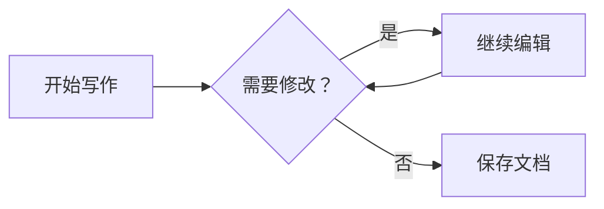

# 开始写作

一份文档，一处编辑。这里是 **tiny-md**。

输入 Markdown 即可排版。光标进入某一行时，该行会显示语法标记。

## 今天的想法

- [ ] 写下第一个想法
- [ ] 整理成一篇文章
- [x] 开始行动

你可以使用 **粗体**、*斜体*、~~删除线~~ 和 `行内代码`。

> 慢慢写，让想法变得清楚。

### 一个小例子

```rust
fn main() {
    println!("你好，tiny-md！");
}
```

## 输入与编辑

中文、English、emoji 🌱 都应该自然地工作。

试试跨行选择、复制粘贴，再撤销一次。

## 流程图

点击图形即可展开 Mermaid 源码，光标离开后恢复预览。



---

从这里继续。
